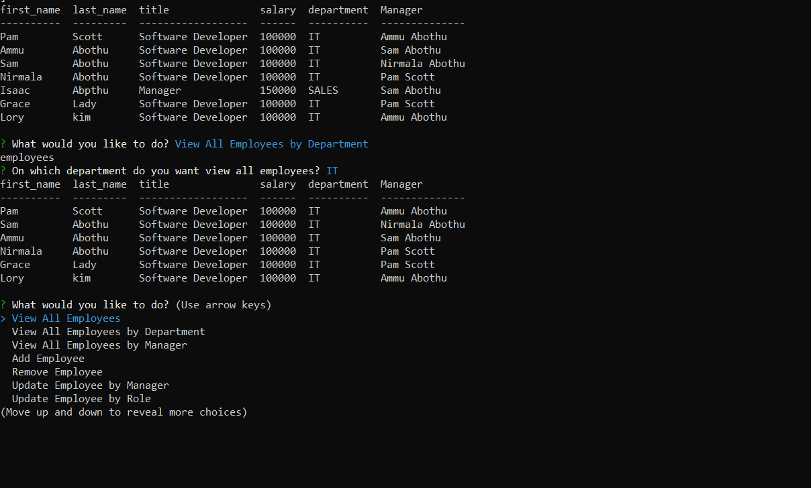

# employee-management-system-11.29.20

## About The Project

---

This application is about Employee Management System from Command Line Interface.
This application allows user to perfome following tasks

-    View All Employees
-    View All Employees by Department
-    View All Employees by Manager
-    Add Employee
-    Remove Employee
-    Update Employee by Manager
-    Update Employee by Role

First application prompts to user the following options:

-    View All Employees
-    View All Employees by Department
-    View All Employees by Manager
-    Add Employee
-    Remove Employee
-    Update Employee by Manager
-    Update Employee by Role

If user select View All Employees option,then user can able to see
all the employees with the following details(columns):

-    first_name
-    last_name
-    title
-    salary
-    department
-    Manager

If user select View All Employees by Department option,then user can able to see
all the employees for that perticular department.

If user select View All Employees by Manager option,then user can able to see
all the employees for that perticular Manager.

If user select Add Employee option,then user will be prompted with the
following questions:

-    What is employee's first-name
-    What is employee's last-name
-    What is employee's role:
     with list of role's title.
-    Select the manager for employee:
     with list of managers.

If user select Remove Employee option,then user will be prompted with the
following question:

-    Select employee do you want remove?:
     with list of employee names,after user select employee name
     from the list,then perticular employee will be deleted from
     the employee table.

If user select Update Employee by Manager option,then user will be prompted with the
following questions:

-    Select employee do you want update?:
     with list of employee names,after user select employee name
     from the list,then user will be prompted with the following
     question
-    Select manager do you want assign?:
     with list of managers.
     Then peticular employee will be update with new Manager.

If user select Update Employee by Role option,then user will be prompted with the
following questions:

-    Select employee do you want update?:
     with list of employee names,after user select employee name
     from the list,then user will be prompted with the following
     question
-    Select role do you want assign to selected employee?:
     with list of role titles.
     Then peticular employee will be update with new role.

If user select EXIT option,connection will end and
application exit.

## Implemented the following functionalities

-    View All Employees
-    View All Employees by Department
-    View All Employees by Manager
-    Add Employee
-    Remove Employee
-    Update Employee by Manager
-    Update Employee by Role

## Built With

Node modules

-    Inquirer : to prompts the user with questions
-    mysql
-    express

## Getting Started

To get a local copy up and running follow below steps.

## Prerequisites

None

## Installation instructions:

Clone the repo git clone git@github.com:NirmalaAbothu/employee-management-system-11.29.20.git then open Git Bash window ,navigate to project folder then run
following commands

-    run "npm install" or "npm i"
-    run "npm mysql"
-    run "node app.employee-tracker.js"
-    if you get any error saying that perticular package cann't find, please install that specific package by runnig following command
     run "npm run packagename(wahtever package missed)"
     after install missing package again run the following command
     run "node app.employee-tracker.js" and
     select options from list and enter or select values as app directs.

## Credits

Followed the documentation about mysql

## License & copyright

Copyright © 2020 Nirmala Abothu

## Project Demo Links

[Demo1](https://drive.google.com/file/d/1kOvEiWOwXcq3T1eeUioXk0-Tf8reyfn1/view?usp=sharing)

[Demo2](https://drive.google.com/file/d/1PBIj_hWJ37QnRR9gg9fyATfqvO65fFNI/view?usp=sharing)

[Demo3](https://drive.google.com/file/d/1FB0Sq_cWNIahoTXclq5DJC5Rn0wLaix_/view?usp=sharing)

[Demo4](https://drive.google.com/file/d/150HB-ot-190QN3l8EWKkA4lgeWjbMjrM/view?usp=sharing)

[Demo5](https://drive.google.com/file/d/13KWKwL2kNx8wBm31-Piy3P-lOJL9uMex/view?usp=sharing)
